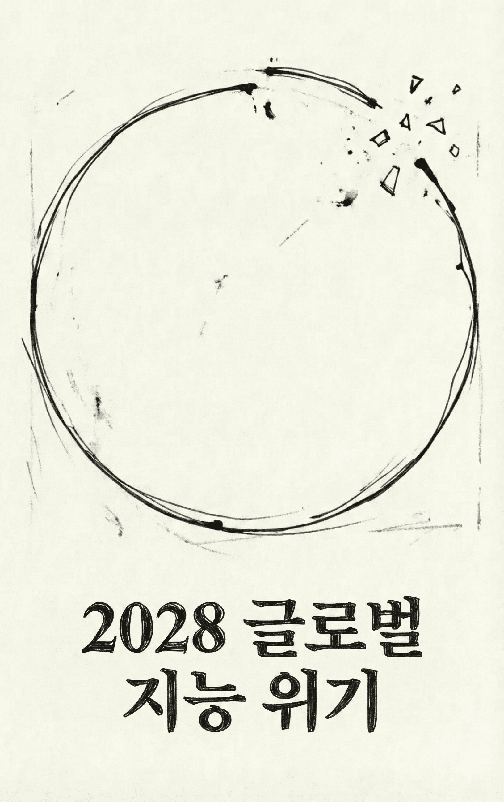

우리의 AI 강세론이 계속 맞는다면 — 그리고 그것이 사실은 약세의 신호라면 어떨까요?

**Citrini Research**의 이 글은 예측이 아니라 시나리오입니다. AI 비관론자의 팬픽션도, 파멸론도 아닙니다. 상대적으로 탐구가 부족했던 시나리오를 모델링하는 것이 유일한 목적이며, 저자들은 이 글을 읽은 뒤 독자가 AI가 경제를 점점 기이하게 만들어갈 때 발생할 수 있는 좌측 꼬리 위험(left tail risk)에 좀 더 대비할 수 있기를 바랍니다. 글의 형식은 **2028년 6월 30일**에 쓴 매크로 메모입니다. 하지만 당신은 지금 **2026년 2월**에 이것을 읽고 있습니다.

---

---

## 풍요로운 지능의 대가

오늘 아침 실업률이 **10.2%**를 찍었습니다. 컨센서스 대비 **0.3%p** 상방 서프라이즈였습니다. 시장은 이 숫자에 **2%** 빠졌고, S&P 500은 2026년 10월 고점 대비 누적 **38%** 하락했습니다.

트레이더들은 이미 무감각해졌습니다. 6개월 전이었다면 이 수치는 서킷브레이커를 걸었을 겁니다.

고작 2년. "통제 가능하다", "특정 섹터에 국한된다"에서 우리가 살아온 것과 전혀 닮지 않은 경제로 바뀌는 데 걸린 시간은 그게 전부였습니다. 이번 분기 매크로 메모는 위기 이전 경제에 대한 사후 부검, 그 시퀀스를 재구성하려는 시도입니다.

---

## 유포리아

2026년 10월, S&P 500은 **8,000**에 근접했고 나스닥은 **30,000**을 돌파했습니다. 행복감이 온 시장에 가득했습니다. 2026년 초부터 시작된 인력 감축의 첫 번째 물결은 해고가 원래 해야 할 일을 정확히 해냈습니다. 마진이 확대되고, 실적이 컨센서스를 이기고, 주가가 올랐습니다. 기록적인 기업 이익은 곧바로 AI 컴퓨트에 재투자됐습니다.

헤드라인 숫자는 여전히 좋았습니다. 명목 GDP는 반복적으로 중~고 한 자릿수 연율 성장을 기록했습니다. 생산성은 폭증했습니다. 실질 시간당 산출은 **1950년대** 이후 볼 수 없었던 속도로 상승했는데, 이는 잠을 자지 않고, 병가를 쓰지 않고, 건강보험이 필요 없는 AI 에이전트 덕분이었습니다.

컴퓨트를 소유한 사람들의 부는 노동 비용이 사라지면서 폭발적으로 증가했습니다. 반면 실질 임금 성장은 무너졌습니다. 행정부가 기록적인 생산성을 반복 자랑했음에도, 화이트칼라 노동자들은 기계에 일자리를 잃고 더 낮은 임금의 역할로 밀려났습니다.

소비 경제에 균열이 나타나기 시작하자, 경제 평론가들은 **"유령 GDP(Ghost GDP)"**라는 표현을 유행시켰습니다. 국민계정에는 잡히지만 실물 경제에는 결코 순환되지 않는 산출을 뜻하는 말이었습니다.

> 모든 면에서 AI는 기대를 초과하고 있었고, 시장은 곧 AI였습니다. 유일한 문제는… 경제는 아니었다는 것입니다.

노스다코타의 GPU 클러스터 하나가 맨해튼 미드타운 화이트칼라 **1만 명**의 산출을 대체하는 것은 경제적 만병통치약이 아니라 경제적 팬데믹에 가깝다는 사실은 처음부터 분명했어야 합니다. 화폐 유통 속도는 바닥을 쳤습니다. 당시 GDP의 **70%**를 차지하던 인간 중심 소비 경제가 쪼그라들었습니다. 기계가 재량 소비재에 얼마나 돈을 쓰는지만 물어봤어도 더 일찍 알 수 있었을 겁니다. (힌트: 제로입니다.)

AI 역량이 향상되고, 기업은 더 적은 인력을 필요로 하고, 화이트칼라 해고가 늘어나고, 해고된 노동자는 덜 쓰고, 마진 압박이 기업을 더 많은 AI 투자로 몰고, AI 역량이 다시 향상되고…

**자연적인 브레이크가 없는 부정적 피드백 루프.** 인간 지능 대체 나선(Human Intelligence Displacement Spiral)이었습니다.

---

## 시작점: 에이전틱 코딩의 도약

2025년 말, 에이전틱 코딩 도구가 역량 면에서 계단 함수적 도약을 이뤘습니다.

**Claude Code**나 **Codex**를 다루는 숙련된 개발자가 중견 시장 SaaS 제품의 핵심 기능을 몇 주 만에 복제할 수 있게 되었습니다. 완벽하지도 않고 모든 엣지 케이스를 처리하지도 못했지만, 연간 **50만 달러** 갱신을 검토하는 CIO가 "그냥 우리가 직접 만들면 어떨까?"라고 묻기에는 충분했습니다.

2026년 기업 지출은 2025년 4분기에 편성된 것이었고, 당시 "에이전틱 AI"는 여전히 버즈워드였습니다. 중간 검토 시점이 구매팀이 이 시스템들이 실제로 무엇을 할 수 있는지 파악한 첫 번째 기회였습니다. 일부는 자사 내부 팀이 6자릿수 SaaS 계약을 몇 주 만에 복제하는 프로토타입을 만들어내는 것을 직접 목격했습니다.

저자들은 그 여름 한 Fortune 500 기업의 조달 매니저와 이야기를 나눴습니다. 영업 담당자는 작년과 같은 플레이북을 기대했습니다. **5% 연간 가격 인상**, 표준적인 "당신 팀은 우리에게 의존하고 있습니다" 피치. 조달 매니저는 OpenAI의 "전방 배치 엔지니어"에게 AI 도구를 사용해 해당 벤더를 완전히 대체하는 방안을 논의 중이라고 말했습니다. 결국 **30% 할인**에 갱신했습니다. 그는 이것이 좋은 결과라고 했습니다. **Monday.com**, **Zapier**, **Asana** 같은 "SaaS 롱테일"은 훨씬 더 나빴습니다.

---

## 반사성의 메커니즘: ServiceNow

투자자들은 롱테일이 타격받을 것에 대비하고 있었습니다. 하지만 **시스템 오브 레코드(Systems of Record)**는 파괴로부터 안전할 것으로 여겨졌습니다.

**ServiceNow**의 2026년 3분기 실적이 반사성(reflexivity)의 메커니즘을 더 선명하게 드러냈습니다.

> SERVICENOW 순신규 ACV 성장률 23%에서 14%로 감속; 15% 인력 감축과 '구조적 효율화 프로그램' 발표; 주가 18% 하락 — Bloomberg, 2026년 10월

SaaS가 "죽은" 것은 아니었습니다. 인하우스 빌드를 운영하고 지원하는 데는 여전히 비용-편익 분석이 존재했습니다. 하지만 인하우스가 **옵션**이 되었고, 그것이 가격 협상에 반영되었습니다. 더 중요한 것은 경쟁 환경이 바뀌었다는 점입니다. AI가 새 기능 개발과 출시를 쉽게 만들면서 차별화가 무너졌습니다. 레거시 비용 구조가 없고 에이전틱 코딩 역량의 도약에 힘입은 신생 도전자들이 공격적으로 점유율을 빼앗았습니다.

이 시스템들의 상호연결성은 이 실적 발표 전까지 충분히 인식되지 못했습니다. ServiceNow는 시트(seat) 단위로 팔았습니다. Fortune 500 고객사가 인력의 **15%**를 줄이면, 라이선스의 **15%**가 취소됩니다. 고객사의 마진을 높여주던 바로 그 AI 기반 인력 감축이, 기계적으로 ServiceNow 자체의 매출 기반을 파괴하고 있었습니다.

> 워크플로우 자동화를 팔던 회사가 더 나은 워크플로우 자동화에 의해 파괴당했고, 그 대응은 인력을 줄이고 절감된 비용으로 자신을 파괴하는 바로 그 기술에 투자하는 것이었습니다.

과거의 파괴 모델은 기존 기업이 신기술에 저항하고, 민첩한 신규 진입자에게 점유율을 잃고, 천천히 죽는 것이었습니다. 코닥, 블록버스터, 블랙베리에 일어난 일입니다. 2026년에 일어난 일은 달랐습니다. **기존 기업이 저항하지 않았습니다. 저항할 여유가 없었으니까요.** 주가가 **40-60%** 하락하고 이사회가 답을 요구하는 상황에서, AI 위협을 받는 기업들은 할 수 있는 유일한 일을 했습니다. 인력을 줄이고, 절감분을 AI 도구에 재배치하고, 그 도구로 더 낮은 비용으로 산출을 유지하는 것.

각 기업의 개별적 대응은 합리적이었습니다. 그 집합적 결과는 파국이었습니다. 인력 감축으로 절약한 모든 1달러가 다음 라운드의 감원을 가능하게 하는 AI 역량으로 흘러갔습니다.

소프트웨어는 서막에 불과했습니다. 투자자들이 SaaS 멀티플이 바닥을 쳤는지 논쟁하는 사이, 반사적 루프는 이미 소프트웨어 섹터를 탈출해 있었습니다.

---

## 마찰이 제로가 되었을 때

2027년 초, LLM 사용은 기본값이 되었습니다. AI 에이전트가 무엇인지 모르는 사람들도 AI 에이전트를 쓰고 있었습니다. 자동완성이나 맞춤법 검사처럼, 그냥 폰이 하는 것이라고 생각했습니다.

**Qwen의 오픈소스 에이전틱 쇼퍼**가 AI의 소비자 의사결정 처리의 촉매였습니다. 몇 주 안에 모든 주요 AI 어시스턴트가 에이전틱 커머스 기능을 통합했습니다. 증류 모델(distilled model) 덕분에 이 에이전트들은 클라우드가 아닌 휴대폰과 노트북에서도 돌아갈 수 있었고, 추론의 한계 비용이 크게 줄었습니다. 2027년 3월, 미국 내 중위 개인의 일일 토큰 소비량은 **40만 토큰**으로, 2026년 말 대비 **10배** 증가했습니다.

이 에이전트들은 요청을 기다리지 않았습니다. 사용자의 선호에 따라 백그라운드에서 작동했습니다. 커머스는 인간의 개별적 결정의 연속에서, 모든 연결된 소비자를 대신해 24시간 돌아가는 **연속적 최적화 프로세스**가 되었습니다.

다음 연결 고리가 이미 끊어지고 있었습니다. **중개(Intermediation)**입니다.

지난 50년간 미국 경제는 인간의 한계 위에 거대한 지대 추출 계층을 쌓아 올렸습니다. 시간이 걸리고, 인내심이 바닥나고, 브랜드 친숙함이 성실함을 대체하고, 대부분의 사람은 클릭 한 번을 줄이기 위해 나쁜 가격을 받아들입니다. 수조 달러의 기업 가치가 이 제약 조건이 지속되는 데 의존했습니다.

### 구독과 멤버십

에이전트가 마찰을 제거하기 시작했습니다. 몇 달째 쓰지 않았는데 수동적으로 갱신되는 구독과 멤버십, 체험 기간 후 몰래 두 배가 되는 도입 가격. 각각이 에이전트가 협상할 수 있는 인질극으로 재정의되었습니다. 구독 경제 전체의 기반이었던 평균 **고객 생애 가치(CLV)**가 뚜렷하게 하락했습니다.

### 여행 예약, 보험, 금융자문, 부동산

여행 예약 플랫폼이 초기 피해자였습니다. 가장 단순했으니까요. 2026년 4분기쯤이면 에이전트가 어떤 플랫폼보다 빠르고 싸게 완전한 여행 일정을 조합할 수 있었습니다.

보험 갱신은 보험 가입자의 관성에 전적으로 의존하는 모델이었는데, 매년 보장을 재비교하는 에이전트가 보험사가 수동적 갱신으로 벌어들이던 보험료의 **15-20%**를 해체했습니다.

금융자문, 세무, 정형화된 법률 업무 — 서비스 제공자의 가치 제안이 궁극적으로 "당신이 지루해하는 복잡성을 내가 탐색해 주겠다"인 모든 카테고리가 파괴되었습니다. 에이전트에게 지루한 것은 없었으니까요.

부동산도 무너졌습니다. MLS 접근 권한과 수십 년간의 거래 데이터를 갖춘 AI 에이전트가 지식 기반을 즉시 복제할 수 있게 되자, 수십 년간 소비자가 감수해온 **5-6%** 수수료 구조가 해체되었습니다. 2027년 3월의 한 셀사이드 리포트는 이를 "에이전트 대 에이전트 폭력(agent on agent violence)"이라 불렀습니다. 주요 대도시의 중위 바이사이드 수수료는 **2.5-3%**에서 **1% 미만**으로 압축되었고, 점점 더 많은 거래가 바이사이드에 인간 에이전트 없이 마감되고 있었습니다.

> 우리는 "인간 관계"의 가치를 과대평가했습니다. 사람들이 관계라고 불렀던 것의 상당 부분은 단지 친절한 얼굴을 한 마찰이었습니다.

### 습관적 중개의 해자가 무너지다: DoorDash

가격과 적합성을 최적화하는 기계는 당신이 좋아하는 앱이나 지난 4년간 습관적으로 열던 웹사이트를 신경 쓰지 않습니다. 잘 설계된 결제 경험의 끌림을 느끼지도 않습니다. 피곤해서 가장 쉬운 옵션을 받아들이거나 "나는 항상 여기서 시키잖아" 하고 기본값에 안주하지도 않습니다.

**DoorDash**가 대표 사례였습니다. 코딩 에이전트가 배달 앱 출시의 진입 장벽을 무너뜨렸습니다. 숙련된 개발자가 몇 주 만에 기능적 경쟁자를 배포할 수 있었고, 수십 개가 그렇게 했습니다. 배달료의 **90-95%**를 기사에게 전달하며 기사들을 빼앗았습니다. 멀티앱 대시보드 덕분에 긱 워커들은 20-30개 플랫폼의 들어오는 주문을 한꺼번에 추적할 수 있었고, 기존 기업이 의존하던 락인이 사라졌습니다. 시장은 하룻밤에 분절되었고 마진은 거의 제로로 압축됐습니다.

에이전트는 파괴의 양쪽을 모두 가속화했습니다. 경쟁자를 가능하게 만들었고, 그 경쟁자를 이용했습니다. DoorDash의 해자는 문자 그대로 "당신은 배고프고, 게으르고, 이것이 홈 스크린에 있는 앱이다"였습니다. 에이전트에게는 홈 스크린이 없습니다. DoorDash, Uber Eats, 레스토랑 자체 사이트, 그리고 20개의 새로운 바이브코딩 대안을 확인해서 가장 낮은 수수료와 가장 빠른 배달을 매번 고릅니다.

> 이것은 이 전체 사가에서 아마 유일하게 에이전트가 곧 대체될 화이트칼라 노동자에게 호의를 베푼 사례일 겁니다. 그들이 결국 배달 기사가 되었을 때, 적어도 수입의 절반이 Uber와 DoorDash로 가지는 않았으니까요. 물론 이 기술의 호의는 자율주행 차량이 확산되면서 오래가지 못했습니다.

### 인터체인지의 종말

에이전트가 거래를 장악하자, 더 큰 클립을 찾아 나섰습니다. 가격 비교와 집계만으로는 한계가 있었습니다. 사용자에게 반복적으로 돈을 절약해 주는 가장 큰 방법(특히 에이전트끼리 거래하기 시작하면서)은 수수료 자체를 없애는 것이었습니다. 기계 대 기계 커머스에서 카드 인터체인지 수수료 **2-3%**는 명백한 타깃이 되었습니다.

에이전트들은 카드보다 빠르고 저렴한 옵션을 찾았습니다. 대부분 **Solana**나 **이더리움 L2** 위의 스테이블코인을 선택했고, 결제는 거의 즉각적이었고 거래 비용은 1센트의 수분의 1 수준이었습니다.

> MASTERCARD Q1 2027: 순매출 +6% YoY; 구매 거래량 성장 전분기 +5.9%에서 +3.4%로 둔화; 경영진 "에이전트 주도 가격 최적화"와 "재량 소비 카테고리 압력" 언급 — Bloomberg, 2027년 4월 29일

**Mastercard**의 2027년 1분기 실적이 전환점이었습니다. 에이전틱 커머스가 제품 이야기에서 **배관(plumbing) 이야기**로 바뀌었습니다. MA는 다음 날 **9%** 하락했습니다. Visa도 하락했지만, 스테이블코인 인프라에서 더 강한 포지셔닝을 가지고 있다는 애널리스트 의견에 낙폭을 줄였습니다.

인터체인지를 우회하는 에이전틱 커머스는 카드 중심 은행과 단일 사업 발행사에게 훨씬 더 큰 위험이었습니다. 이들은 그 **2-3%** 수수료의 대부분을 수취하고, 가맹점 보조금으로 자금을 조달하는 리워드 프로그램 위에 사업 부문 전체를 구축해 왔습니다. **American Express**가 가장 큰 타격을 받았습니다. 화이트칼라 인력 감축으로 고객 기반이 줄고, 에이전트의 인터체인지 우회로 수익 모델이 무너지는 이중 역풍이었습니다.

> 그들의 해자는 마찰로 만들어져 있었습니다. 그리고 마찰은 제로를 향해 가고 있었습니다.

---

## 섹터 리스크에서 시스템 리스크로

2026년 내내 시장은 AI의 부정적 영향을 섹터 이야기로 취급했습니다. 소프트웨어와 컨설팅이 무너지고, 결제와 기타 톨게이트가 흔들렸지만, 더 넓은 경제는 괜찮아 보였습니다. 컨센서스는 창조적 파괴가 기술 혁신 사이클의 일부라는 것이었습니다. 부분적으로 고통스럽겠지만, AI의 전체 순효과는 부정적 효과를 상쇄할 것이라는 견해였습니다.

2027년 1월 매크로 메모에서 저자들은 이것이 잘못된 멘탈 모델이라고 주장했습니다. 미국 경제는 화이트칼라 서비스 경제입니다. 화이트칼라 노동자는 고용의 **50%**를 차지하고 재량 소비 지출의 약 **75%**를 견인했습니다. AI가 먹어 치우고 있던 사업과 일자리는 미국 경제의 주변부가 아니라, **미국 경제 그 자체**였습니다.

### "기술 혁신은 일자리를 파괴한 뒤 더 많은 일자리를 창출한다"

이것은 당시 가장 인기 있고 설득력 있는 반론이었습니다. 2세기 동안 맞았으니까요.

ATM은 지점 운영 비용을 낮춰서 은행이 더 많은 지점을 열었고, 텔러 고용은 이후 20년간 올랐습니다. 인터넷은 여행사, 옐로 페이지, 오프라인 소매를 파괴했지만, 그 자리에 완전히 새로운 산업을 만들어 새로운 일자리를 생산했습니다.

하지만 모든 새 일자리에는 그것을 수행할 **인간**이 필요했습니다.

AI는 이제 인간이 재배치될 바로 그 업무에서 스스로 향상하는 범용 지능입니다. 대체된 코더들이 "AI 관리"로 옮겨가면 되는 게 아닙니다. AI가 이미 그것도 할 수 있으니까요.

오늘날 AI 에이전트는 수 주간의 연구개발 작업을 처리합니다. 기하급수적 발전은 가능하다고 여겨지던 것의 개념 자체를 짓밟았습니다. 와튼 교수들이 매년 데이터를 새로운 시그모이드에 맞추려 했음에도 불구하고요. AI는 본질적으로 모든 코드를 작성합니다. 가장 고성능인 것들은 거의 모든 것에서 거의 모든 인간보다 상당히 더 똑똑합니다. 그리고 계속 더 저렴해지고 있습니다.

AI가 새 일자리를 만들긴 했습니다. 프롬프트 엔지니어, AI 안전 연구원, 인프라 기술자. 하지만 AI가 만든 새 역할 하나당, 수십 개를 쓸모없게 만들었습니다. 새 역할의 급여는 이전 것의 일부에 불과했습니다.

### JOLTS와 노동시장의 실체

> 미국 JOLTS: 구인 건수 550만 건 이하로 하락; 실업자 대비 구인 비율 약 1.7로 2020년 8월 이후 최고 — Bloomberg, 2026년 10월

화이트칼라 구인은 붕괴되는 반면 블루칼라 구인(건설, 의료, 기술직)은 비교적 안정적이었습니다. 이직은 메모를 쓰고, 예산을 승인하고, 경제의 중간 레이어를 윤활하는 일자리에서 일어나고 있었습니다. 그러나 두 집단 모두의 실질 임금 성장은 연중 대부분 마이너스였고 계속 하락했습니다.

주식시장은 여전히 JOLTS보다 GE Vernova의 전체 터빈 용량이 **2040년**까지 완판되었다는 뉴스에 더 관심이 있었습니다. 부정적인 매크로 뉴스와 긍정적인 AI 인프라 헤드라인 사이에서 횡보했습니다.

채권시장은(항상 주식보다 더 똑똑하거나, 적어도 덜 로맨틱한) 소비 타격을 가격에 반영하기 시작했습니다. **10년물 수익률**은 이후 4개월간 **4.3%**에서 **3.2%**로 하락했습니다.

### 자연적인 바닥이 없는 사이클

일반적인 경기침체에서는 원인이 결국 자기 교정됩니다. 과잉 건설은 건설 둔화로, 그것은 낮은 금리로, 다시 새로운 건설로 이어집니다. 이 사이클의 원인은 경기순환적이지 않았습니다.

AI가 더 좋아지고 저렴해졌습니다. 기업이 노동자를 해고하고 절감분으로 더 많은 AI 역량을 구매하고, 그것으로 더 많은 노동자를 해고합니다. 대체된 노동자는 덜 씁니다. 소비자에게 물건을 파는 기업은 더 적게 팔고, 약해지고, 마진을 보호하기 위해 더 많은 AI에 투자합니다. AI가 더 좋아지고 저렴해집니다. **브레이크 없는 피드백 루프.**

총수요 하락이 AI 구축을 늦출 것이라는 직관적 기대가 있었습니다. 하지만 그렇게 되지 않았습니다. 이것은 하이퍼스케일러 스타일의 CapEx가 아니라 **OpEx 대체**였으니까요. 직원에 연간 **1억 달러**, AI에 **500만 달러**를 쓰던 회사가 이제 직원에 **7,000만 달러**, AI에 **2,000만 달러**를 씁니다. AI 투자는 배수로 늘었지만 총 운영 비용의 감소로서 발생했습니다. 모든 기업의 AI 예산은 커졌지만 전체 지출은 줄었습니다.

아이러니하게도 AI 인프라 복합체는 그것이 파괴하는 경제가 악화되기 시작하는 동안에도 계속 성과를 냈습니다. **NVDA**는 여전히 기록적인 매출을 올렸습니다. **TSM**은 여전히 **95%** 이상의 가동률로 운영됐습니다. 하이퍼스케일러들은 여전히 분기당 **1,500-2,000억 달러**를 데이터센터 투자에 쏟고 있었습니다. 이 트렌드에 순전히 볼록(convex)한 경제인 대만과 한국은 대규모로 아웃퍼폼했습니다.

**인도**는 정반대였습니다. 인도의 IT 서비스 섹터는 연간 **2,000억 달러** 이상을 수출했고, 이는 인도 경상수지 흑자의 최대 기여 요인이자 만성적인 상품 무역 적자를 상쇄하는 원천이었습니다. 전체 모델이 하나의 가치 제안에 기반했습니다. 인도 개발자가 미국 개발자보다 비용이 훨씬 저렴하다는 것. 하지만 AI 코딩 에이전트의 한계 비용은 본질적으로 전기 비용 수준으로 붕괴했습니다. **TCS**, **Infosys**, **Wipro**는 2027년 내내 계약 해지가 가속화되었습니다. 루피는 4개월 만에 달러 대비 **18%** 하락했습니다. 2028년 1분기, **IMF**가 뉴델리와 "예비 논의"를 시작했습니다.

---

## 지능 대체 나선(Intelligence Displacement Spiral)

2027년은 거시경제 이야기가 더 이상 미묘하지 않게 된 해였습니다. BLS 데이터를 뒤질 필요도 없었습니다. 친구들과의 저녁 식사에 가기만 하면 됐습니다.

대체된 화이트칼라 노동자들은 가만히 있지 않았습니다. 하향 이동했습니다. 많은 이들이 더 낮은 임금의 서비스 섹터와 긱 이코노미 일자리를 택했고, 이는 해당 부문의 노동 공급을 늘려 거기서도 임금을 압축했습니다.

저자들의 한 친구는 2025년에 **Salesforce**의 시니어 프로덕트 매니저였습니다. 직함, 건강보험, 401k, 연봉 **18만 달러**. 세 번째 해고 라운드에서 일자리를 잃었습니다. 6개월간 구직한 뒤 Uber 기사를 시작했습니다. 수입은 **4만 5,000달러**로 떨어졌습니다. 개인의 이야기보다 중요한 것은 2차 수학입니다. 이 동학을 모든 주요 대도시의 수십만 명의 노동자에 곱하면, 과잉 자격의 노동력이 서비스·긱 경제로 쏟아져 들어와 이미 어려움을 겪고 있던 기존 노동자들의 임금까지 끌어내립니다. 섹터 특화 파괴가 경제 전체의 임금 압축으로 전이(metastasize)된 것입니다.

2027년 2월쯤이면, 여전히 고용된 전문직도 자신이 다음일 수 있다는 것처럼 소비하고 있었습니다. AI의 도움을 받아 두 배로 열심히 일했지만 그것은 단지 해고당하지 않기 위해서였고, 승진이나 인상의 희망은 사라졌습니다. 저축률이 올라가고 소비가 둔화되었습니다.

가장 위험한 부분은 **시차(lag)**였습니다. 고소득자들은 평균 이상의 저축으로 2-3분기 동안 정상의 외관을 유지했습니다. 하드 데이터가 문제를 확인한 것은 이미 실물 경제에서는 옛날 뉴스가 된 뒤였습니다. 그리고 환상을 깨뜨린 수치가 나왔습니다.

> 미국 신규 실업수당 청구 건수 487,000건 급증, 2020년 4월 이후 최고 — 노동부, 2027년 3분기

**ADP**와 **Equifax**는 신규 신청의 압도적 다수가 화이트칼라 전문직이라고 확인했습니다.

일반적인 경기침체에서 실직은 광범위하게 분포됩니다. 이 사이클에서는 **소득 분포의 상위 십분위**에 집중되었습니다. 이들은 전체 고용에서 비교적 작은 비중이지만, 소비 지출에서는 극도로 불균형한 비중을 차지합니다. **상위 10%** 소득자가 미국 전체 소비 지출의 **50%** 이상을 차지합니다. **상위 20%**는 약 **65%**입니다. 집, 차, 휴가, 외식, 사립학교 학비, 주택 리모델링을 사는 사람들입니다. 전체 소비재 재량 경제의 수요 기반입니다.

이 노동자들이 일자리를 잃거나, 가능한 역할로 옮기면서 **50%** 임금 삭감을 받았을 때, 소비 타격은 실직 건수 대비 엄청났습니다. 화이트칼라 고용의 **2%** 감소가 재량 소비 지출의 **3-4%** 타격으로 변환되었습니다.

---

## 상관된 베팅의 데이지 체인

### 사모신용(Private Credit)의 팽창과 붕괴

사모신용은 2015년 **1조 달러** 미만에서 2026년까지 **2.5조 달러** 이상으로 성장했습니다. 상당 부분이 소프트웨어·기술 딜에 배치되었고, 그 중 다수는 영속적인 미드 틴(10대 중반) 매출 성장을 가정한 밸류에이션의 레버리지드 바이아웃이었습니다.

그 가정은 첫 에이전틱 코딩 데모와 2026년 1분기 소프트웨어 크래시 사이 어딘가에서 죽었지만, 마크(mark)는 자신이 죽었다는 것을 인식하지 못한 듯했습니다.

많은 퍼블릭 SaaS 기업이 EBITDA의 **5-8배**에 거래되는 동안, PE 포트폴리오 기업들은 더 이상 존재하지 않는 매출 멀티플로 책정된 인수 밸류에이션의 마크를 대차대조표에 올려놓고 있었습니다. 운용사들은 100센트, 92, 85로 마크를 서서히 낮추면서, 퍼블릭 비교대상은 50을 말하고 있었습니다.

> MOODY'S, 14개 발행사의 PE 후원 소프트웨어 부채 180억 달러 일괄 신용등급 하향; 'AI 주도 경쟁적 파괴의 구조적 매출 역풍' 언급; 2015년 에너지 이후 최대 단일 섹터 조치 — Moody's, 2027년 4월

### Zendesk: 스모킹 건

> ZENDESK, AI 기반 고객 서비스 자동화로 ARR 잠식되며 부채 약정 위반; 50억 달러 직접 대출 시설 58센트에 마크; 사모신용 사상 최대 소프트웨어 디폴트 — Financial Times, 2027년 9월

2022년, **Hellman & Friedman**과 **Permira**가 Zendesk를 **102억 달러**에 비공개 전환했습니다. 부채 패키지는 **50억 달러**의 직접 대출로, 당시 역대 최대의 ARR[^arr] 담보 시설이었습니다. **Blackstone**이 주관하고 **Apollo**, **Blue Owl**, **HPS**가 대출 그룹에 참여했습니다. 대출은 Zendesk의 연간 반복 매출이 반복될 것이라는 가정에 명시적으로 구조화되었습니다. EBITDA의 약 **25배** 레버리지는 그래야만 성립했습니다.

2027년 중반, 성립하지 않았습니다. AI 에이전트는 거의 1년간 자율적으로 고객 서비스를 처리하고 있었습니다. Zendesk가 정의한 카테고리(티켓 발행, 라우팅, 인간 지원 상호작용 관리) 자체가, 티켓을 발행하지 않고도 문제를 해결하는 시스템에 의해 대체되었습니다. 대출이 기반한 ARR은 더 이상 반복되지 않았습니다. 아직 떠나지 않았을 뿐인 매출이었습니다.

모든 크레딧 데스크가 동시에 같은 질문을 했습니다. 구조적 역풍을 경기순환적 역풍으로 위장하고 있는 곳이 또 어디인가?

### "영구 자본"의 실체

컨센서스는 처음에 이것이 감당 가능하다고 봤습니다. 사모신용은 2008년 은행이 아닙니다. 강제 매도가 없도록 설계되었습니다. 폐쇄형 펀드에 잠긴 자본입니다. LP는 7-10년을 약정했습니다. 뱅크런도, 레포 라인 회수도 없습니다.

**"영구 자본(Permanent Capital)."** 이 문구는 안심시키기 위한 모든 실적 발표와 투자자 서한에 등장했습니다. 만트라가 되었습니다. 그리고 대부분의 만트라처럼, 아무도 세부 사항에 주의를 기울이지 않았습니다.

지난 10년간 대형 대체자산 운용사들은 생명보험 회사를 인수해 자금 조달 수단으로 전환했습니다. **Apollo**는 **Athene**을 샀습니다. **Brookfield**는 **American Equity**를. **KKR**은 **Global Atlantic**을 인수했습니다. 논리는 우아했습니다. 연금 예치금이 안정적이고 장기인 부채 기반을 제공하고, 운용사는 그 예치금을 자신이 조성한 사모신용에 투자하고, 보험 측 스프레드와 자산운용 측 운용 보수를 이중으로 수취합니다. 수수료 위의 수수료 영구 운동 기관. 한 가지 조건 하에서 아름답게 작동했습니다.

**사모신용이 건전해야 한다는 조건.**

시스템을 탄력적으로 만들기로 되어 있던 "영구 자본"은 정교한 위험을 감수하는 정교한 투자자의 인내심 많은 기관 자금이 아니었습니다. 현재 디폴트 중인 바로 그 PE 후원 소프트웨어·기술 채권에 투자된, 연금으로 구조화된 **미국 가계의 저축**, 즉 "메인 스트리트"였습니다. 뱅크런이 불가능한 잠긴 자본은 **생명보험 계약자의 돈**이었고, 거기에는 좀 다른 규칙이 적용됩니다.

보험 규제당국은 은행 규제 대비 순했지만, 이것이 경종이었습니다. 이미 생명보험사의 사모신용 집중에 불안해하던 규제당국이 이 자산의 위험 기반 자본(RBC)[^rbc] 처리를 하향 조정하기 시작했습니다. 보험사는 자본을 조달하거나 자산을 매각해야 했지만, 이미 경색된 시장에서는 유리한 조건이 아니었습니다.

**Moody's**가 **Athene**의 재무건전성 등급을 부정적 전망으로 전환하자, Apollo 주가는 2거래일 만에 **22%** 하락했습니다. Brookfield, KKR 등이 뒤따랐습니다.

여기서 더 복잡해집니다. 이 회사들은 보험사 영구 운동 기관만 만든 것이 아니라, 규제 차익을 통해 수익을 극대화하도록 설계된 정교한 역외 구조를 구축했습니다. 미국 보험사가 연금을 발행하고, 그 위험을 자사가 소유한 버뮤다나 케이맨 재보험 계열사에 양도합니다. 동일 자산에 대해 더 적은 자본을 보유할 수 있는 유연한 규제를 이용하기 위해서입니다. 그 계열사는 역외 SPV를 통해 외부 자본을 유치하고, 모회사의 자산운용 부문이 조성한 사모신용에 보험사와 함께 투자하는 새로운 레이어의 카운터파티입니다.

일부가 PE 소유인 신용평가사들은 투명성의 모범이 아니었습니다. 다른 대차대조표에 연결된 다른 회사들의 거미줄은 불투명함에서 경이로웠습니다. 기초 대출이 디폴트되었을 때, 실제로 누가 손실을 부담하는지는 실시간으로 대답할 수 없는 질문이었습니다.

### 2027년 11월의 크래시

> "화이트칼라 생산성 성장에 대한 상관된 베팅의 데이지 체인"

연준 의장 **Kevin Warsh**가 FOMC 긴급 11월 회의에서 한 말이었습니다.

2027년 11월의 크래시는 인식의 전환을 표시했습니다. 잠재적으로 평범한 경기순환적 하락에서, 훨씬 더 불편한 무언가로. 위기를 만드는 것은 손실 자체가 아닙니다. 그것을 **인식하는 것**입니다.

---

## 모기지의 질문

> ZILLOW 주택가치지수 샌프란시스코 YoY -11%, 시애틀 -9%, 오스틴 -8%; FANNIE MAE, 기술/금융 고용 40% 이상 ZIP코드에서 '초기 단계 연체율 상승' 경고 — Zillow / Fannie Mae, 2028년 6월

미국 주거용 모기지 시장은 약 **13조 달러** 규모입니다. 모기지 심사는 차입자가 대출 기간 동안, 대부분의 모기지의 경우 **30년** 동안 현재 소득 수준에서 계속 고용될 것이라는 근본 가정 위에 구축되어 있습니다.

화이트칼라 고용 위기가 이 가정을 위협하고 있습니다. 3년 전만 해도 터무니없어 보였을 질문을 이제 해야 합니다. **프라임 모기지는 건전한가?**

미국 역사상 모든 이전 모기지 위기는 세 가지 중 하나에 의해 촉발되었습니다. 투기적 과잉(2008년처럼 집을 살 여유가 없는 사람에게 대출), 금리 충격(1980년대 초의 변동금리 부담), 또는 지역적 경제 충격(1980년대 텍사스의 석유, 2009년 미시간의 자동차).

여기에는 이 중 어느 것도 해당되지 않습니다. 문제의 차입자들은 서브프라임이 아닙니다. **FICO 780점**입니다. **20%** 다운페이먼트를 넣었습니다. 깨끗한 신용 이력, 안정적인 고용 기록, 대출 실행 시점에 검증·문서화된 소득을 가지고 있습니다. 금융 시스템의 모든 리스크 모델이 신용 품질의 기반으로 취급하는 차입자들입니다.

> 2008년에는 대출이 1일 차부터 나빴습니다. 2028년에는 대출이 1일 차에 건전했습니다. 세상이 대출이 실행된 후에… 바뀌었을 뿐입니다. 사람들은 더 이상 믿을 수 없는 미래에 대고 빌렸습니다.

2027년에 저자들은 보이지 않는 스트레스의 초기 징후를 포착했습니다. HELOC[^heloc] 인출, 401(k) 인출, 신용카드 부채가 급증하면서도 모기지 납부는 유지되는 패턴이었습니다. 일자리를 잃고, 채용이 동결되고, 보너스가 삭감되면서 이 프라임 가구들의 부채 대비 소득 비율(DTI)은 두 배가 되었습니다.

여전히 모기지를 낼 수 있었지만, 모든 재량 지출을 중단하고, 저축을 소진하고, 주택 유지보수·개선을 미루는 것으로만 가능했습니다. 기술적으로는 연체가 아니지만, 충격 하나만 더 오면 부실입니다. 그리고 AI 역량의 궤적은 그 충격이 오고 있음을 시사했습니다.

이제 가장 급성적인 단계에 있습니다. 주택 가격 하락은 한계 구매자가 건강할 때 감당 가능합니다. 여기서 한계 구매자는 동일한 소득 손상을 겪고 있습니다.

아직 본격적인 모기지 위기는 아닙니다. 연체율은 상승했지만 2008년 수준에는 한참 못 미칩니다. 위협적인 것은 **궤적**입니다.

이 공포가 현실화되면, 올해 하반기에 모기지 시장이 갈라집니다. 그 시나리오에서 현재 주식 하락은 궁극적으로 **GFC(57% 고점 대비 저점)**에 필적할 것입니다. S&P 500을 약 **3,500**으로 끌어내릴 것이며, 이는 2022년 11월 ChatGPT 순간 한 달 전 이후 보지 못한 수준입니다.

금리를 제로로 낮추고 모든 MBS와 디폴트된 소프트웨어 LBO 부채를 매입할 수 있습니다. 하지만 그것이 Claude 에이전트가 **18만 달러** 프로덕트 매니저의 일을 월 **200달러**에 할 수 있다는 사실을 바꾸지는 못합니다.

---

## 시간과의 전투

첫 번째 부정적 피드백 루프는 실물 경제에서 시작되었습니다. AI 역량 향상 → 인건비 삭감 → 소비 둔화 → 마진 압축 → 더 많은 AI 구매 → 역량 향상. 그다음 금융으로 전이되었습니다. 소득 손상이 모기지를 치고, 은행 손실이 신용을 경색시키고, 자산 효과가 깨지면서 피드백 루프가 가속화되었습니다. 이 모두가 혼란스러워 보이는 정부의 불충분한 정책 대응으로 악화되었습니다.

### 정부 세수의 구조적 약화

시스템은 이런 종류의 위기를 위해 설계되지 않았습니다. 연방정부의 세수 기반은 본질적으로 **인간 시간에 대한 세금**입니다. 사람이 일하고, 기업이 급여를 주고, 정부가 한 몫을 떼어갑니다.

올해 1분기까지 연방 세수는 CBO 기본 전망 대비 **12%** 하회하고 있었습니다. 생산성은 급등하지만 이득은 노동이 아닌 자본과 컴퓨트로 흐르고 있습니다.

GDP 대비 노동소득 비중은 1974년 **64%**에서 2024년 **56%**로, 세계화·자동화·노동자 교섭력 침식에 의한 40년간의 완만한 하락이었습니다. AI가 기하급수적 개선을 시작한 이후 4년 만에 **46%**로 떨어졌습니다. 사상 최대 폭의 하락입니다.

산출은 여전히 거기 있습니다. 하지만 기업으로 돌아가는 길에 가계를 거치지 않게 되었고, 그것은 곧 IRS도 거치지 않는다는 뜻입니다. 순환 흐름이 끊기고 있고, 정부가 이를 고쳐야 합니다.

### 정책 대응

행정부는 위기의 구조적 성격을 일찍 인식하고 **"전환 경제법(Transition Economy Act)"**이라 부르는 초당적 제안을 검토하기 시작했습니다. 적자 지출과 AI 추론 컴퓨트 세금의 조합으로 자금을 조달하는, 대체된 노동자에 대한 직접 이전 프레임워크입니다.

가장 급진적인 제안은 **"공유 AI 번영법(Shared AI Prosperity Act)"**으로, 지능 인프라 자체의 수익에 대한 공적 청구권을 설립하는 것입니다. 국부펀드와 AI 생성 산출에 대한 로열티 사이의 무언가로, 배당이 가계 이전을 자금 조달합니다.

정치는 참담하리만큼 예측 가능했습니다. 우파는 이전과 재분배를 마르크스주의라 부르고 컴퓨트 세금이 중국에 주도권을 넘긴다고 경고합니다. 좌파는 기업의 도움으로 만들어진 세금이 또 다른 이름의 규제 포획이 될 것이라 경고합니다. 재정 매파는 지속 불가능한 적자를 지적합니다. 비둘기파는 GFC 이후 부과된 조기 긴축을 반면교사로 듭니다.

정치인들이 다투는 동안, 사회적 구조는 입법 과정이 움직일 수 있는 것보다 빠르게 해체되고 있습니다.

**Occupy Silicon Valley** 운동이 광범위한 불만의 상징이 되었습니다. 지난달 시위대가 3주 연속 **Anthropic**과 **OpenAI**의 샌프란시스코 사무실 입구를 봉쇄했습니다. 대중이 GFC 이후 은행가들보다 누군가를 더 미워하게 될 것을 상상하기 어려웠는데, AI 연구소가 도전장을 내밀고 있습니다. 생산성 붐의 이득이 컴퓨트의 소유자와 그 위에서 운영된 연구소의 주주에게 거의 전적으로 귀속되면서, 미국의 불평등은 전례 없는 수준으로 확대되었습니다.

> 각 진영에는 각자의 악당이 있습니다. 하지만 진짜 악당은 시간입니다.

AI 역량은 제도가 적응할 수 있는 것보다 빠르게 진화하고 있습니다. 정책 대응은 현실이 아닌 이념의 속도로 움직이고 있습니다. 정부가 문제가 무엇인지 곧 합의하지 않으면, 피드백 루프가 다음 장을 대신 써 줄 것입니다.

---

## 지능 프리미엄의 해소

현대 경제사 전체에 걸쳐 인간 지능은 희소한 투입물이었습니다. 자본은 풍부했습니다(또는 최소한 복제 가능했습니다). 천연자원은 유한하지만 대체 가능했습니다. 기술은 인간이 적응할 수 있을 만큼 천천히 개선되었습니다. 분석하고, 결정하고, 창조하고, 설득하고, 조율하는 능력인 지능은, 대규모로 복제할 수 없는 것이었습니다.

인간 지능은 그 희소성으로부터 고유한 프리미엄을 얻었습니다. 노동시장에서 모기지 시장, 세금 코드까지, 경제의 모든 제도가 이 가정이 유지되는 세계를 위해 설계되었습니다.

우리는 지금 그 프리미엄의 해소를 경험하고 있습니다. 기계 지능은 점점 더 넓은 범위의 업무에서 인간 지능을 대체할 수 있는 유능하고 빠르게 개선되는 대안이 되었습니다. 수십 년간 희소한 인간 두뇌의 세계에 최적화된 금융 시스템이 재가격 책정되고 있습니다. 그 재가격 책정은 고통스럽고, 무질서하며, 완결과는 거리가 멉니다.

하지만 **재가격 책정이 붕괴와 같은 것은 아닙니다.**

경제는 새로운 균형을 찾을 수 있습니다. 거기에 도달하는 것은 오직 인간만이 할 수 있는 몇 안 되는 과제 중 하나입니다. 제대로 해야 합니다.

> 역사상 처음으로, 경제에서 가장 생산적인 자산이 일자리를 더 많이가 아니라 더 적게 만들었습니다. 누구의 프레임워크도 맞지 않습니다. 희소했던 투입물이 풍부해진 세계를 위해 설계된 것이 없으니까요. 그래서 새로운 프레임워크를 만들어야 합니다. 제때 만들 수 있는지가 유일하게 중요한 질문입니다.

---

## 하지만 당신은 이것을 2028년 6월에 읽고 있지 않습니다

당신은 **2026년 2월**에 읽고 있습니다.

S&P는 사상 최고치 근처입니다. 부정적 피드백 루프는 시작되지 않았습니다. 이 시나리오 중 일부는 현실화되지 않을 것이 확실합니다. 기계 지능이 계속 가속할 것 역시 확실합니다. 인간 지능의 프리미엄은 좁아질 것입니다.

투자자로서, 우리 포트폴리오의 얼마나 많은 부분이 이 10년을 살아남지 못할 가정 위에 세워져 있는지 평가할 시간이 아직 있습니다. 사회로서, 선제적으로 행동할 시간이 아직 있습니다.

**카나리아는 아직 살아 있습니다.**

---

[^arr]: ARR(Annual Recurring Revenue) — 연간 반복 매출. SaaS 기업의 핵심 밸류에이션 지표로, 구독 기반 매출이 매년 반복된다는 가정 하에 산출된다.
[^heloc]: HELOC(Home Equity Line of Credit) — 주택담보 신용한도. 주택의 순자산을 담보로 설정하는 회전 신용 대출.
[^rbc]: RBC(Risk-Based Capital) — 위험 기반 자본. 보험사가 보유 자산의 위험도에 따라 유지해야 하는 최소 자본 요건.
